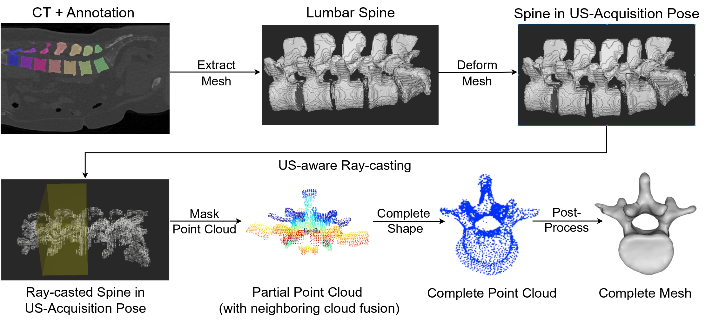

# Shape Completion in the Dark: Completing Vertebrae Morphology from 3D Ultrasound

## Description 
This repository publishes the code of the IPCAI 2024 Paper "Shape Completion in the Dark:Completing Vertebrae Morphology from 3D Ultrasound".
We provide our implementation for the synthetic data generation pipeline as well as the shape completion network.



## Installation
```
git clone https://github.com/miruna20/Shape-Completion-in-the-Dark
cd Shape-Completion-in-the-Dark
git submodule init 
git submodule update 
```
## Usage


## Data
The synthetic vertebrae dataset can be found at https://drive.google.com/drive/folders/1t4NKXOOPODdw3QgYy95Yk3VLsYbeb018

